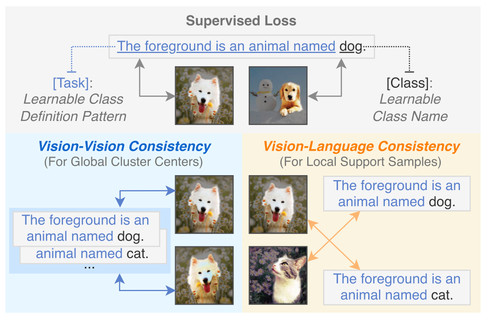

# Consistent Prompt Tuning (CPT) for GCD
Code for the IJCV paper:

> **Title:** Consistent Prompt Tuning for Generalized Category Discovery 
> **Authors:** Muli Yang, Jie Yin, Yanan Gu, Cheng Deng, Hanwang Zhang, Hongyuan Zhu  
> **Paper:** [Springer Link](https://link.springer.com/article/10.1007/s11263-024-02343-w)

## Introduction
**Abstract:** Generalized Category Discovery (GCD) aims at discovering both known and unknown classes in unlabeled data, using the knowledge learned from a limited set of labeled data. Despite today’s foundation models being trained with Internet-scale multi-modal corpus, we find that they still struggle in GCD due to the ambiguity in class definitions. In this paper, we present Consistent Prompt Tuning (CPT) to disambiguate the classes for large vision-language models (e.g., CLIP). To this end, CPT learns a set of “task + class” prompts for labeled and unlabeled data of both known and unknown classes, with the “task” tokens globally shared across classes, which contain a unified class definition pattern, e.g., “the foreground is an animal named” or “the background scene is”. These prompts are optimized with two efficient regularization techniques that encourage consistent global and local relationships between any two matched inputs. CPT is evaluated on various existing GCD benchmarks, as well as in new practical scenarios with fewer annotations and customized class definitions, demonstrating clear superiority and broad versatility over existing state-of-the-art methods.
 

      
    <em>
    Conceptual illustration of “task + class” prompts and CPT objective.
    </em>

## Code
Please refer to [this issue](https://github.com/muliyangm/CPT/issues/1) for the code release. We apologize for the inconvenience.
